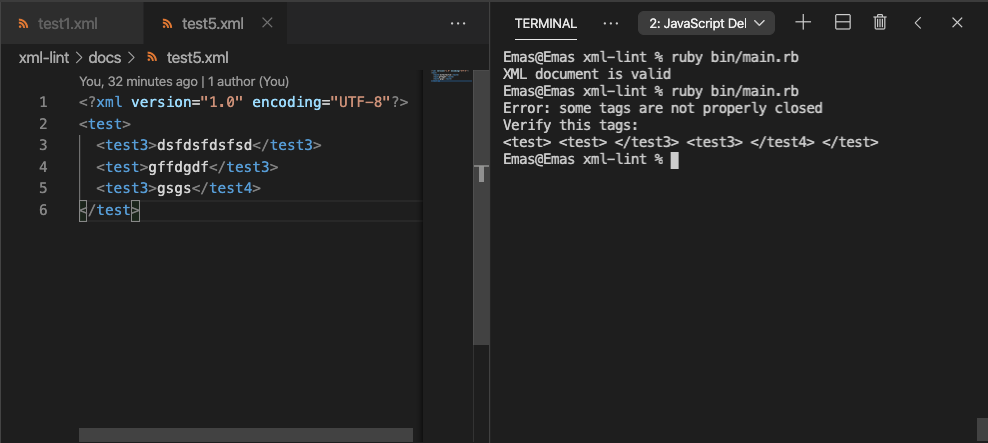

# Ruby XML Lint

> This project is to validate if an XML document is well formed and in case it doesn't it will show you the tags that are no properly closed.

Great to use after parsing an XML file or String.

## Built With

- Ruby

## Getting Started

**This is an example of how you may give instructions on setting up your project locally.**
**Modify this file to match your project, remove sections that don't apply. For example: delete the testing section if the currect project doesn't require testing.**

To get a local copy up and running follow these simple example steps.

### Prerequisites

- Ruby

### Usage

- Clone or download this project
- Open a terminal and cd to the folder where the project lives
- run ruby bin/main.rb

Note: You can validate XML documents from strings or from files. In order to do that just add the xml file to the docs folder and put the name of the file in the main.rb

File.open("./docs/{name of your file}.xml")

### Deployment

## Authors

👤 **Emanuel González**

- Github: [@emasdev](https://github.com/emasdev)
- Twitter: [@elemasss](https://twitter.com/elemass)

## 🤝 Contributing

Contributions, issues and feature requests are welcome!

Feel free to check the [issues page](issues/).

## Show your support

Give a ⭐️ if you like this project!

## 📝 License

This project is [MIT](lic.url) licensed.
